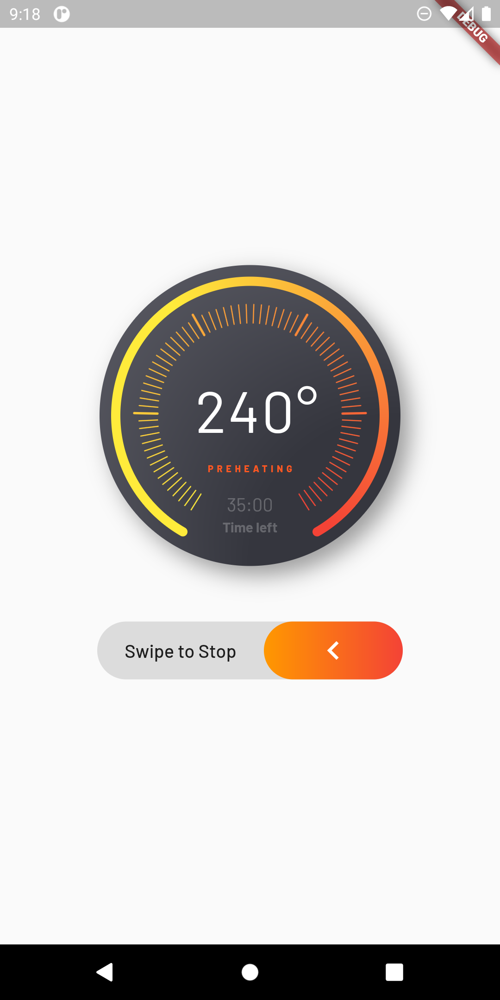
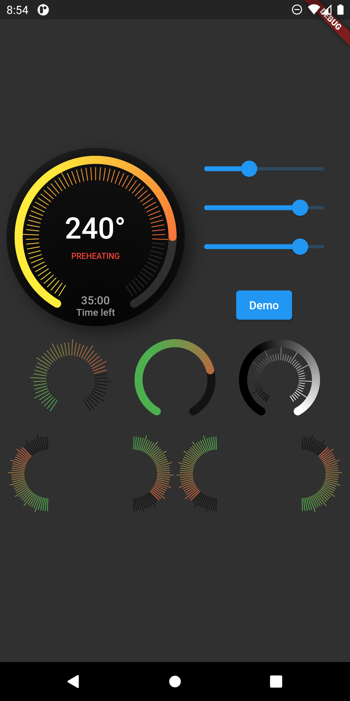

# flutter_advanced_progress
An advanced progress widget, that can be fully customized with bunch of properties, just try it and enjoy!

| State 1 | State 2 |
|:-:|:-:|
|  |  |

## AdvancedProgress Parameters
|Parameter|Description|Type|Default|
|:--------|:----------|:---|:------|
|`primaryValue`|Value for primary progress.|*double*||
|`secondaryValue`|Value for secondary progress.|*double*||
|`secondaryWidth`|Secondary progress width.|*double*|10.0|
|`radius`|Total radius for whole widget.|*double*||
|`startAngle`|Progress start angle.|*double*|120.0|
|`maxDegrees`|Progress degrees from [startAngle].|*double*|300.0|
|`progressGap`|Gap between primary and secondary progress.|*double*|0.0|
|`division`|Primary progress division.|*int*|10|
|`levelAmount`|Amount of levels on primary progress.|*int*||
|`levelLowWidth`|Width of levels on primary progress.|*double*|1.0|
|`levelLowHeight`|Height of low levels on primary progress.|*double*|8.0|
|`levelHighWidth`|Height of high levels managed by [division] on primary progress.|*double*|2.0|
|`levelHighHeight`|Width of levels on primary progress.|*double*|16.0|
|`levelHighBeginEnd`|True if need to begin and end with high level.|*bool*|false|
|`primaryColor`|Primary color that used as a color for progress of first in gradient.|*Color*||
|`secondaryColor`|Secondary color that used last in gradient.|*Color*||
|`tertiaryColor`|Tertiary color that used for inactive part of progress.|*Color*||
|`child`|Child widget.|*Widget*||
