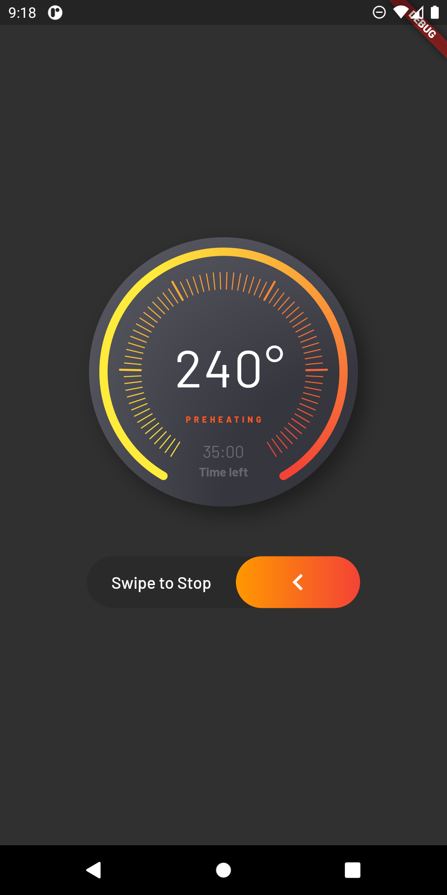

# flutter_advanced_progress
An advanced progress widget, that can be fully customized with bunch of properties, just try it and enjoy!

| State 1 | State 2 |
|:-:|:-:|
|  |  |

## AdvancedProgress Parameters
|Parameter|Description|Type|Default|
|:--------|:----------|:---|:------|
|`primaryValue`|Value for primary progress.|*double*||
|`secondaryValue`|Value for secondary progress.|*double*||
|`secondaryWidth`|Secondary progress width.|*double*|10.0|
|`radius`|Total radius for whole widget.|*double*|required|
|`startAngle`|Progress start angle.|*double*|120.0|
|`maxDegrees`|Progress degrees from `startAngle`.|*double*|300.0|
|`progressGap`|Gap between primary and secondary progress.|*double*|0.0|
|`division`|Primary progress division.|*int*|10|
|`levelAmount`|Amount of levels on primary progress.|*int*|required|
|`levelWidth`|Width of levels on primary progress.|*double*|1.0|
|`levelLow`|Height of low levels on primary progress.|*double*|8.0|
|`levelHigh`|Height of high levels managed by `division` on primary progress.|*double*|16.0|
|`primaryColor`|Primary color that used as a color for progress of first in gradient.|*Color*|theme.indicatorColor|
|`secondaryColor`|Secondary color that used last in gradient.|*Color*|`primaryColor`|
|`tertiaryColor`|Tertiary color that used for inactive part of progress.|*Color*|theme.hintColor|
|`child`|Child widget.|*Widget*||